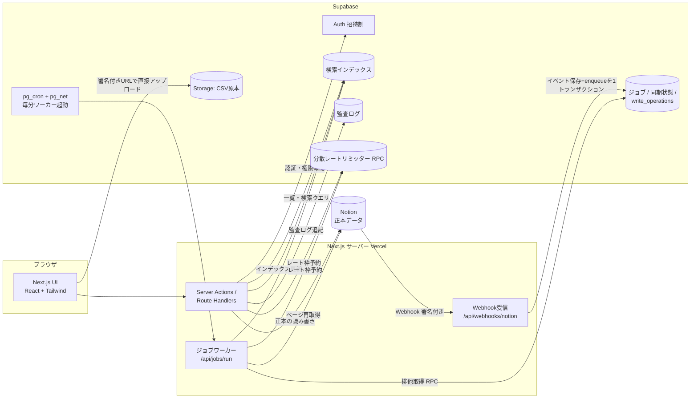

# システムアーキテクチャ

改訂履歴: 2026-08-05 設計レビュー反映(Notion APIバージョン更新、JobScheduler抽象化、分散レート制御、write_operations、Supabase新APIキー方針ほか)。

## 1. 全体構成



### 原則

- **ブラウザはNotion APIに一切触れない。** Notionへのアクセスはすべてサーバー(Server Actions / Route Handlers / ワーカー)経由。
- **一覧・検索・集計はSupabaseインデックスのみを参照**し、Notion APIを呼ばない。
- **詳細表示はNotionの正本を取得**する。負荷軽減のための短時間キャッシュ(60秒程度、`revalidate`)は許容するが、編集開始時は必ず最新の正本を再取得する。
- 書き込みは常に「write_operations記録 → Notion更新 → 監査ログ → インデックス更新」の順(詳細は [sync-design.md](./sync-design.md))。
- **UI・CSV・Webhook・整合性確認を含むすべてのNotionリクエストは、Supabase上の分散レートリミッターを通過する**([sync-design.md §5](./sync-design.md#5-notion-apiレート制限への対応分散レート制御))。プロセスメモリ内のキューだけで全体レート制限を保証しない(サーバレスの複数インスタンスでは保証不能なため)。

## 2. 技術スタックと選定理由

| 分類 | 技術 | 理由 |
|------|------|------|
| フレームワーク | Next.js(最新安定版、App Router) | サーバー側でのNotion API集約、Server Actions、Vercelとの親和性 |
| 言語 | TypeScript(strict) | `any` 多用禁止・型エラー無視禁止の要件 |
| UI | Tailwind CSS + shadcn/ui | shadcn/uiはプリミティブとして採用し、情報密度・余白・罫線・導線を本システム用に全面調整(デフォルトデザインの流用禁止。[ui-guidelines.md](./ui-guidelines.md)) |
| フォーム | React Hook Form + Zod | 入力検証をクライアント/サーバーで共通スキーマ化 |
| テーブル | TanStack Table | 列表示切替・固定列・ソート・複数選択などの高密度一覧要件 |
| データ取得 | TanStack Query | クライアント側の検索・一覧のキャッシュと再取得制御 |
| 認証 | Supabase Auth + `@supabase/ssr` | 招待制、Google OAuth、middlewareでのセッション更新。サーバーでは `getUser()` で検証(`getSession()` を信用しない) |
| DB | Supabase PostgreSQL(RLS有効) | 検索インデックス・監査ログ・ジョブ管理・分散レートリミッター。`pg_trgm` で類似検索、`pg_cron` + `pg_net` でワーカー起動 |
| ストレージ | Supabase Storage(private bucket) | CSV原本の保管(署名付きURLで直接アップロード) |
| Notion | `@notionhq/client`(**APIバージョン `2026-03-11` 対応版以上**) | データソースAPI(`/v1/data_sources`)、ビュー作成API(`/v1/views`)、公式Webhook対応。サーバー専用モジュールに隔離 |
| テスト | Vitest + Playwright | 単体・統合 / E2E |

### バージョン方針

- Phase 1着手時に各パッケージの最新安定版を確認して固定する(`package.json` に明示)。
- **Notion APIバージョンは `2026-03-11` を明示指定**し、Webhookサブスクリプションも同バージョンで作成する。`@notionhq/client` は同バージョンに対応したリリース以上を使用する。
- ページの削除状態は `in_trash` フィールドで判定する(`archived` は使用しない)。

### Supabase APIキー方針(2026年時点の公式方針)

Supabaseはレガシーの `anon` / `service_role` キー(JWT形式)を廃止予定(2026年末)としており、新しいAPIキーへ移行済みの前提で設計する。

| キー | 用途 | 特性 |
|---|---|---|
| Publishable key(`sb_publishable_...`) | ブラウザ・公開クライアント | 低権限。RLSが適用される。`NEXT_PUBLIC_` で公開可 |
| Secret key(`sb_secret_...`) | サーバー・ワーカー | **RLSをバイパスする**。ブラウザからの使用は401で拒否される(User-Agent判定)。サービスごとに複数発行・個別ローテーション可 |

- 本システムでは、ブラウザ=Publishable key+ユーザーJWT(RLS適用)、サーバーのシステム操作=Secret key(RLSバイパス)と明確に分離する。Secret keyでの操作はRLSに守られないため、**サーバー側の権限チェック・Zod検証・監査ログ・冪等化(write_operations)が防御の主体**となる([supabase-schema.md §8](./supabase-schema.md#8-rlsとapiキーの権限方針))。

## 3. SSoT境界

### Notionに保存する(正本)

顧客アカウント / 顧客担当者 / 案件 / 対応履歴 / 契約 / クレーム / **次回アクション** / 営業マスタ / 自社担当者マスタ(計9データベース。[notion-schema.md](./notion-schema.md))

### Supabaseに保存する(正本ではない)

| 分類 | 内容 |
|------|------|
| 認証・ユーザー | auth.users、アプリユーザープロフィール、権限、招待(user_invitations)、プロビジョニング状態 |
| 対応管理 | NotionページIDとの対応(全インデックステーブルの主キー)、external_id対応 |
| 検索インデックス | 一覧表示・検索・絞り込み・集計に必要な項目のキャッシュ+正規化済み検索文字列(action_index含む) |
| 書込整合性 | write_operations(作成・更新操作の冪等化とクラッシュ復旧) |
| 監査ログ | 追記専用(トリガーで更新・削除禁止)。変更項目のみのbefore/after |
| 同期 | 同期状態・同期エラー・Webhookイベントログ・整合性確認結果・Notionスキーマ(プロパティID)スナップショット |
| ジョブ | 汎用ジョブキュー(排他制御列付き)、CSVインポート状態 |
| レート制御 | Notion API分散レートリミッター(送信枠予約・グローバル停止) |
| ファイル | CSVインポート原本(Storage private bucket、30日で削除) |
| 利用者向け補助 | 保存済み検索、最近閲覧した顧客 |
| 設定 | system_settings(スキーマスナップショット参照等) |

### キャッシュ境界の明確化(重要)

- **キャッシュする**: 一覧のテーブル列・検索対象・フィルタ対象・KPI集計に必要な項目(顧客の表示名・住所・電話・各マスタ参照・最終対応日・次回予定日・見込み金額、アクションの期限・状態など)。
- **キャッシュしない**: 対応履歴の本文、クレームの内容・原因・対応内容・再発防止策などの長文(これらは**Notionページ本文ブロック**が正本。[notion-schema.md §10](./notion-schema.md#10-長文の扱いページ本文ブロック))、契約書ファイル。詳細表示時にNotionから取得する。
- インデックスの各行は `sync_status` / `last_synced_at` を持ち、UIでは「Notionの正本から同期されたデータであること」を前提に扱う。インデックスを直接編集する画面は作らない。

## 4. ディレクトリ構成

```
docs/                          # 設計文書(本書ほか)
scripts/
  setup-notion.ts              # 9DB+標準ビュー作成、プロパティID保存、初期マスタ投入
src/
  app/
    (auth)/
      login/page.tsx           # ログイン
      reset-password/page.tsx  # パスワード再設定
    auth/
      callback/route.ts        # OAuth / 招待リンクのコールバック
    (main)/                    # 認証済みレイアウト(サイドナビ+ヘッダー)
      layout.tsx
      page.tsx                 # マイデスク
      customers/
        page.tsx               # 検索・一覧
        new/page.tsx           # 新規登録
        [id]/page.tsx          # 詳細(全活動タイムライン含む)
        [id]/edit/page.tsx     # 編集
      deals/                   # 案件(一覧・詳細)
      users/[id]/page.tsx      # ユーザープロフィール
      admin/
        users/                 # ユーザー管理・招待・権限
        masters/               # マスタ管理
        import/                # CSVインポート
        export/                # CSVエクスポート
        audit/                 # 監査ログ
        sync/                  # 同期状況・同期エラー・Notion削除確認・スキーマ警告
        settings/              # システム設定
    api/
      webhooks/notion/route.ts # Notion Webhook受信(署名検証+1トランザクションenqueue)
      jobs/run/route.ts        # ワーカー(pg_cron/pg_netから毎分起動。CRON_SECRETで保護)
  lib/
    supabase/
      server.ts                # サーバー用クライアント(@supabase/ssr、ユーザーJWT+RLS)
      client.ts                # ブラウザ用クライアント(Publishable keyのみ)
      admin.ts                 # Secret keyクライアント(server-only、RLSバイパス)
      middleware.ts            # セッション更新
    notion/
      client.ts                # Notionクライアント(分散レートリミッター経由+リトライ。server-only)
      rate-limiter.ts          # Supabase RPCによる送信枠予約・グローバル停止
      converters/              # Notionプロパティ <-> ドメイン型の変換層(プロパティID参照、25件超リレーションのページネーション対応)
      schema.ts                # データソースID・プロパティIDスナップショットの読込
    auth/
      permissions.ts           # 権限マトリクスの単一情報源
      require.ts               # サーバー側権限チェックヘルパー
    normalize/                 # 会社名・電話番号・人名・住所の正規化
    sync/                      # 書込パイプライン・Webhook処理・整合性確認・dependency_reindex
    audit/                     # 監査ログ生成(差分計算)
    jobs/
      scheduler.ts             # JobSchedulerの抽象化(起動方式に依存しないインターフェース)
      queue.ts                 # enqueue / claim(排他取得RPC呼び出し)
      handlers/                # kindごとのジョブ処理
    csv/                       # パース・マッピング・重複判定・エクスポート
  components/
    ui/                        # 調整済みプリミティブ(shadcn/uiベース)
    layout/                    # サイドナビ・ヘッダー・ページ枠
  features/                    # 画面単位の複合コンポーネント+Server Actions
    customers/  activities/  actions/  deals/  contracts/  complaints/
    masters/  import/  admin/  mydesk/
  types/                       # ドメイン型定義
supabase/
  migrations/                  # スキーマ+RLS+RPC+トリガー(SQL)
tests/                         # Vitest(単体・統合)
e2e/                           # Playwright
.env.example
README.md
```

### 責務分離の方針

- `lib/notion` 配下は `server-only` パッケージでクライアントバンドルへの混入を防ぐ。
- ドメインロジック(正規化・差分計算・重複判定・権限判定)はUIから独立した純関数とし、単体テスト対象にする。
- 将来のGmail/カレンダー/Slack連携は `lib/integrations/` を追加する前提で、通知・外部連携の呼び出し箇所をイベント発行(監査ログ生成箇所)に集約しておく。

## 5. ジョブ実行アーキテクチャ

### JobSchedulerの抽象化

ワーカー起動方式はデプロイ環境に依存するため、「毎分ワーカーエンドポイントを叩く」役割を **JobScheduler** として抽象化し、実装を差し替え可能にする。ワーカー本体(`/api/jobs/run`)とジョブ処理ロジックは起動方式に依存しない。

| 実装 | 方式 | 採用条件 |
|---|---|---|
| **SupabaseCronScheduler(初期採用)** | Supabase `pg_cron` が毎分、`pg_net`(http拡張)で `POST /api/jobs/run` を呼ぶ(`CRON_SECRET` をヘッダーに付与) | 既定。Vercelのプランに依存しない |
| VercelCronScheduler(代替) | `vercel.json` のCron設定で毎分起動 | **Vercel Pro以上を利用する場合のみ**(Hobbyは毎分Cron不可のため前提にしない) |

- ワーカーは起動のたびに「実行時間上限内で処理できる分だけ処理し、続きを残す」チャンク方式。多重起動されても後述の排他制御により同一ジョブを二重処理しない。
- スケジューラーの死活は `jobs` の滞留(queuedのまま `next_run_at` を過ぎている件数)を管理画面「同期状況」で監視する。

### ジョブの排他制御

- `jobs` テーブルに `locked_by` / `locked_at` / `lease_expires_at` / `heartbeat_at` / `attempts` / `max_attempts` / `next_run_at` を持たせる。
- ワーカーは **`FOR UPDATE SKIP LOCKED` を用いた原子的なジョブ取得RPC(`claim_next_job`)** でジョブを取得する。複数ワーカーが同時起動しても同じジョブを同時処理しない。
- 処理中はheartbeatでリースを延長し、リース切れジョブは他ワーカーが回収して再実行する(`attempts` 上限あり)。定義は [supabase-schema.md §5](./supabase-schema.md#5-同期ジョブ)。

### データフロー(読み取り・書き込み)

1. 一覧・検索: UI → Server Action → Supabase `customer_index` / `action_index` 等(権限確認+RLS)→ 返却。Notion API呼び出しなし。
2. 詳細: UI → Server Component → Notion APIでページ取得(60秒キャッシュ可)→ 変換層でドメイン型へ → 表示。長文(履歴本文等)は展開時にページ本文ブロックを取得。
3. 書き込み: [sync-design.md](./sync-design.md) の書込パイプライン(write_operationsによる冪等化を含む)。

## 6. 環境変数

`.env.example` に以下を定義する(値はコミットしない)。

```
# 公開可(ブラウザに渡る)
NEXT_PUBLIC_SUPABASE_URL=
NEXT_PUBLIC_SUPABASE_PUBLISHABLE_KEY=   # sb_publishable_...
NEXT_PUBLIC_APP_URL=

# サーバー専用(絶対にNEXT_PUBLIC_を付けない)
SUPABASE_SECRET_KEY=                    # sb_secret_...(RLSバイパス。取り扱い注意)
NOTION_TOKEN=
NOTION_WEBHOOK_SECRET=
CRON_SECRET=

# Notion データソースID(setup-notion.tsが出力)
NOTION_DS_CUSTOMERS=
NOTION_DS_CONTACTS=
NOTION_DS_DEALS=
NOTION_DS_ACTIVITIES=
NOTION_DS_CONTRACTS=
NOTION_DS_COMPLAINTS=
NOTION_DS_ACTIONS=
NOTION_DS_MASTERS=
NOTION_DS_STAFF=
```

- プロパティIDのスナップショットは環境変数ではなく `system_settings`(Supabase)と生成ファイルで管理する([notion-schema.md §11](./notion-schema.md#11-プロパティid方式とスキーマ変更検知))。

## 7. エラーハンドリング・ロギング

- ユーザー向けエラーは日本語で状況と次の行動(再試行・管理者連絡)を示す。スタックトレース等の内部情報は出さない。
- サーバーログは構造化(JSON)し、`request_id` で追跡可能にする。パスワード・トークン・Cookie・個人情報の過剰出力を禁止。
- Notion APIのエラー処理は最新公式仕様に従う([sync-design.md §5](./sync-design.md)):
  - 429(rate_limited): `Retry-After` 秒を遵守してグローバル停止+再試行
  - 500/502/503/504: 一時障害。冪等なリクエストは指数バックオフ+ジッタで再試行。書込はwrite_operationsの冪等保護がある場合のみ再試行
  - 400系: 再試行せず失敗(入力・実装の修正対象)。401/403は認証・認可失敗として扱う
- 書込系の最終失敗は `sync_errors` へ、読取系はユーザーへ「Notionに接続できません」系のメッセージを表示。
- フロントは処理中ボタンの無効化(二重送信防止)、保存状態・通信中・エラーの明示を必須とする。

## 8. セキュリティ実装方針

- 秘匿値(Secret key / Notionトークン / Webhook Secret / CRON_SECRET)はサーバー環境変数のみ。`lib/notion` と `lib/supabase/admin.ts` は `server-only` 宣言。
- 全Server Action / Route Handlerの冒頭で `requireUser()` + `requirePermission()` を必須通過(コードレビュー観点に含める)。**Secret key経由の操作はRLSに守られないため、この層が実質的な防御線である。**
- Supabase RLSは「利用者JWTでの読み取り操作」の防壁として全テーブルで有効化([supabase-schema.md](./supabase-schema.md))。
- Webhookは `X-Notion-Signature` 検証(タイミングセーフ比較)。ワーカーRouteは `CRON_SECRET` のBearer検証。
- 変更系Server Actionはリクエストごとの `request_id`(クライアント生成のUUID)と `write_operations` で冪等化し、二重送信・クラッシュ時の二重作成を防ぐ。
- CSVエクスポートは `= + - @ \t \r` で始まるセルを無害化(先頭に `'` 付与)。
- CSV原本はStorage private bucketに保管し、アクセスはサーバー経由+監査ログ記録([csv-import-design.md](./csv-import-design.md))。
