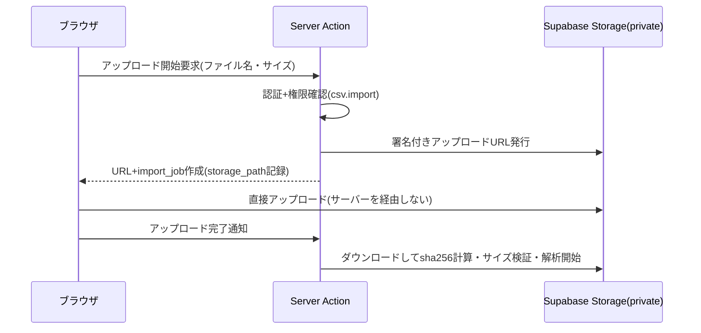
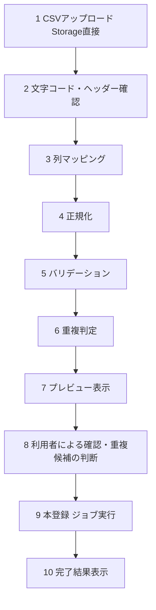

# CSVインポート・エクスポート設計

既存データ(Excel / Googleスプレッドシート由来、1,000〜10,000件想定)の移行手段であり、初期版の必須機能。権限は管理者+A権限のみ([permissions.md](./permissions.md))。

改訂履歴: 2026-08-05 設計レビュー反映(Storage直接アップロード、原本管理、決定的external_id、エクスポート2方式)。2026-08-07 Phase 8実装反映(7エンティティCSV取込、Vault不要のprivate storage、ジョブチャンク、partial success)。2026-08-07 日次 `storage_cleanup` enqueue(`/api/jobs/run` → daily_maintenance)を追記。

## 0. Phase 8 実装サマリ

- 管理画面: `/admin/imports`（権限 `csv.import` = admin + A）
- 対象: 顧客 / 顧客担当者 / 案件 / 対応履歴 / 次回アクション / 契約 / クレーム
- 非対象: 営業マスタ・自社担当者（semantic_key / Auth identity のため専用管理）
- 推奨順: 顧客 → 担当者 → 案件 → 対応履歴 → アクション → 契約 → クレーム（途中entityのみ追加import可）
- 原本: private bucket `imports`、30日期限、`storage_cleanup` で削除
- 実行: `jobs.kind=csv_import` チャンク処理（HTTP内で大量処理しない）
- 冪等: source key / 決定的 external_id + write_operations
- 結果: partial success（成功行はrollbackしない）。cancelは未処理のみ停止
- 個人情報: raw CSVをログ/auditに出さない。`import_rows.staged` は最小payload

## 1. ファイルアップロード(Supabase Storage直接)

**20MB級のCSVをVercel Functionのリクエストボディで受けない**(ボディサイズ・実行時間の制約、メモリ負荷のため)。Supabase Storageの**private bucket(`imports`)へ署名付きURLで直接アップロード**する。

### 原本の管理

- `import_jobs` に `storage_path` / `file_size` / `sha256` / `expires_at`(作成から30日)/ `deleted_at` を記録([supabase-schema.md §9](./supabase-schema.md#9-その他のテーブル))。
- **30日後の原本削除**: 定期ジョブ(kind=`storage_cleanup`)が `expires_at` 超過かつ `deleted_at` がnullの原本をStorageから削除し、`deleted_at` を記録する。**削除失敗は `sync_errors`(stage=`storage_cleanup_failed`)に記録して管理画面で監視**し、放置しない。
- **日次enqueue**: `/api/jobs/run` ワーカー起動時に `ensureDailyMaintenanceJobs()` が走り、UTC日付キー `storage_cleanup:YYYY-MM-DD` で1日1回だけ `storage_cleanup` を enqueue する(`system_settings.key=daily_maintenance` で最終enqueue日を記録)。
- **アクセス権限と監査**: bucketはprivate。ブラウザからの直接読み取りは不可。原本のダウンロードは「管理者またはインポート作成者本人(A権限以上)」のみ、サーバー経由の署名付きダウンロードURL(短寿命)で行い、発行を監査ログ(`csv.file_access`)へ記録する。アップロード用署名URLも権限確認後にのみ発行する。

## 2. インポートフロー(10ステップ)

状態は `import_jobs` / `import_rows` に永続化し、ブラウザを閉じても途中から再開できる。解析(ステップ2〜6)もサイズが大きい場合はジョブとして実行する。

### ステップ詳細

1. **アップロード**: §1の方式。初期版は顧客アカウントを対象。上限20MB。
2. **文字コード・ヘッダー確認**: UTF-8(BOM有無)/ Shift_JIS(CP932)を自動判定し、先頭数行をプレビュー。手動切替可。ヘッダー行の有無も確認。
3. **列マッピング**: CSV列→システム項目。ヘッダー名から自動推測+手動修正。マッピングは保存・再利用可能。未マッピング列は取込対象外として明示。
4. **正規化**: `lib/normalize/` の共通関数(検索インデックスと同一規則)。マスタ参照項目は名称でmasters_cacheと照合し、未知の値は「入力エラー」または「マスタへ新規追加を提案」。
5. **バリデーション**: Zodで行単位検証。エラー行は `invalid`+理由。
6. **重複判定**: §3の優先順位。
7. **プレビュー**: 集計(新規 / 更新 / 重複候補 / エラー / 対象外)+ステータス別タブの行一覧。
8. **利用者確認**: 重複候補ごとに「新規登録 / 既存更新 / 取り込まない」を**一括指定・個別指定**の両方で選択。**自動統合は行わない。**
9. **本登録**: `jobs`(kind=`csv_import`)を生成しワーカーが実行。進捗ポーリング表示。ブラウザを閉じても継続。
10. **完了結果**: 成功・失敗件数、失敗行の理由一覧(CSVダウンロード可、インジェクション対策適用)。失敗行のみ再実行可能。

## 3. 重複判定

既存の `customer_index` と、以下の優先順位で照合する(最初に一致した理由を記録)。

| 優先 | 条件 | 確度 |
|---|---|---|
| 1 | 電話番号(正規化)完全一致 | 高 |
| 2 | 正規化法人名+正規化事業所名の一致 | 高 |
| 3 | 正規化法人名+都道府県の一致 | 中 |
| 4 | trigram類似度が閾値(0.6程度、実測調整)以上 | 低(候補表示のみ) |

- ファイル内の行同士の重複も同じ規則で検出。
- 「既存更新」を選んだ行は**CSV側に値がある項目のみ**上書き(空欄は既存値保持)。プレビューで項目単位の差分を表示。
- 判定ロジックは `lib/csv/duplicate-detector.ts` の純関数とし、単体テスト対象。

## 4. 大量登録のジョブ設計

Notion APIのレート制限([sync-design.md §5](./sync-design.md#5-notion-apiレート制限への対応分散レート制御))を前提とする。10,000件の新規作成は1時間程度かかることをUIに明示する(進捗+推定残り時間)。

- **バッチ処理**: ワーカーは実行時間上限まで `import_rows` を順次処理し、`cursor` で次回継続(チャンク方式)。ジョブは排他制御RPCで取得され、ワーカー多重起動でも二重処理されない。
- **レート制御**: 全リクエストが分散レートリミッター(priority=`bulk`)を経由。429時はグローバル停止に従う。
- **二重登録防止(決定的external_id)**: 各行の `external_id` は **UUIDv5(namespace=import_job_id, name=行番号)で決定的に生成**する。行の処理は書込パイプライン(write_operations)を通り、中断・再実行時は `external_id` でNotionを検索して存在確認するため、**どの時点でクラッシュしても二重作成されない**([sync-design.md §1](./sync-design.md))。
- **中断後の再開 / 一部失敗の再実行**: `imported` 行はスキップ。`import_failed` 行のみの再実行ボタン。
- **登録内容**: 行ごとにNotionページ作成/更新 → インデックスupsert → 監査ログ(`operation_source='csv_import'`、batch_id=import_job_id)。

## 5. エクスポート設計

### 2方式の区別(重要)

Supabaseインデックスは一覧・検索用の項目しか持たないため、「全項目」のエクスポートはインデックスだけでは実現できない。方式を明確に分ける。

| 方式 | データ源 | 出力範囲 | 実行時間 |
|---|---|---|---|
| **高速エクスポート(既定)** | Supabaseインデックス | 一覧・検索・絞り込みに使う項目のみ(=一覧画面の列。備考・本文等の長文は含まない) | 即時〜数秒(5,000件超はジョブ化) |
| **完全エクスポート** | Notion正本(ページ+必要に応じ本文要約) | 全プロパティ | レート制限に従うジョブ(kind=`export_full`)。10,000件で1時間程度かかることを明示。進捗表示+完了時に署名付きダウンロードURL |

- UI上は「高速(一覧項目)」「完全(全項目・時間がかかります)」を明示的に選択させ、出力可能な列の違いを列選択UIに反映する。
- **完全エクスポートは初期版ではページ本文全文を含めない**(要約プロパティまで)と確定する。本文全文のエクスポートはフェーズ2以降の検討事項。

### 共通仕様

- 対象: 全件 / 検索結果のみ / 選択した顧客のみ。
- 出力列の選択UI(既定=一覧の表示列)。列構成は保存可能。
- 形式: UTF-8 BOM付きCSV(Excel対応)。改行CRLF。マスタ参照は名称へ解決、日時はJST。
- 実行は監査ログへ記録(`csv.export`、方式・件数・条件)。
- 生成ファイルはStorage private bucketに置き、短寿命の署名付きURLでダウンロード(原本と同じアクセス統制・期限削除)。
- **CSVインジェクション対策**: セル先頭が `=` `+` `-` `@` `\t` `\r` の場合、先頭に `'` を付与して無害化。全出力経路(エクスポート・エラーレポート)に適用。

## 6. テスト観点(要件21対応)

- 文字コード判定(UTF-8 BOM有無 / CP932)
- 正規化(会社名・電話・都道府県・日付・金額)
- バリデーション(必須・形式・未知マスタ値)
- 重複判定の優先順位と閾値(ファイル内重複含む)
- idempotency(決定的external_idにより、同一行の再実行・クラッシュ後再開で二重作成されない)
- 中断→再開、一部失敗→失敗行のみ再実行
- Storage原本の期限削除と削除失敗の監視
- エクスポート2方式の列範囲・BOM・インジェクション対策
