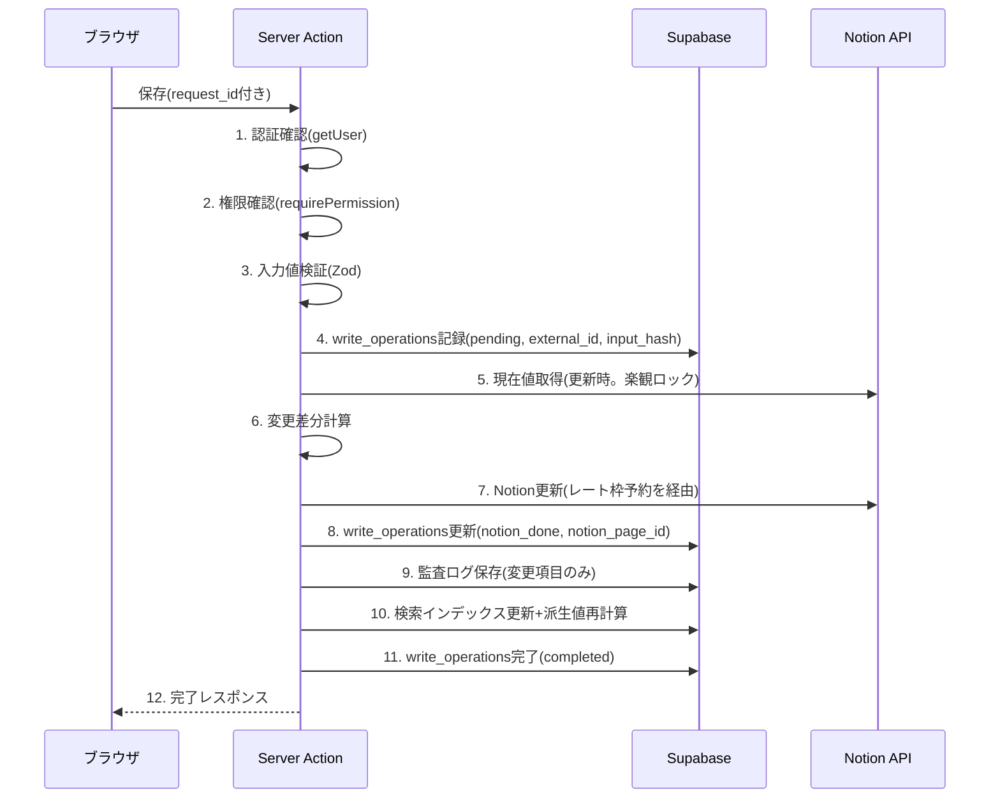
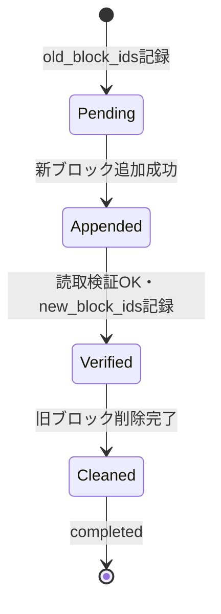
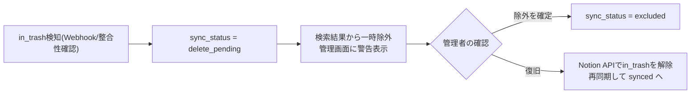

# NotionとSupabaseの同期設計

Notionが正本、Supabaseは検索インデックス・監査・同期状態・書込整合性(write_operations)を持つ([architecture.md](./architecture.md))。

改訂履歴: 2026-08-05 設計レビュー反映(write_operationsによる冪等化、分散レート制御、エラー処理の最新仕様化、in_trash、Webhookの1トランザクションenqueue、ページ本文の監査・競合、dependency_reindex、スキーマ変更検知)。

同期の経路:

1. Webアプリからの更新(アプリ → Notion → インデックス)
2. Notion側からの更新(Webhook → 再取得 → インデックス)
3. Notion側からの削除(削除確認フロー)
4. 定期整合性確認(取りこぼし回収)
5. 派生データの再計算(dependency_reindex)

## 1. Webアプリからの更新(書込パイプライン)

すべての作成・更新は以下の順序を厳守する。実装は `lib/sync/write-pipeline.ts` に共通化し、各Server Action・ジョブハンドラーはこれを経由する。

### 冪等性とクラッシュ復旧(external_id + write_operations)

- **すべてのNotion正本ページはアプリ発行の `external_id`(UUID)プロパティを持つ**([notion-schema.md §0](./notion-schema.md#0-前提))。
- 処理開始時に `write_operations` へ `request_id`(PK)/ `entity_type` / `operation`(create/update)/ `external_id` / `input_hash` / `recovery_payload` / `status='pending'` を記録する。
  - 同一 `request_id` の再送: 既存行のstatusに応じて、完了済みなら前回結果を返し、途中なら復旧処理(下記)へ。二重送信はここで吸収する。
  - 同一 `request_id` で `input_hash` が異なる場合は不正としてエラー。
- CSVインポート・一括履歴登録は**決定的external_id**(UUIDv5: ジョブID+行番号/顧客ID)を使い、ジョブの中断・再実行でも同一external_idとなるようにする。

**作成(create)と更新(update)で復旧手順を明確に分ける。**

#### 作成(create)の復旧

「Notion作成成功 → Supabase更新前」のクラッシュで `pending` のまま残った操作は、該当データソースを `external_id equals` でクエリし、

- ページが存在 → 作成済みと判断し、`notion_page_id` を記録(`notion_done`)して後続(監査・インデックス)から再開
- ページが不在 → 作成から再実行

これにより**二重作成が構造的に発生しない**。

#### 更新(update)の復旧

更新は「同じページへの再実行」になるため存在確認では判定できない。`recovery_payload` に**期待値(更新後にあるべきプロパティ値・本文ハッシュ・リレーション)**を記録しておき、`pending` / `notion_done` で残った更新操作は以下で復旧する。

1. Notionの現在値(ページ+必要なら本文ブロック)を取得する
2. `recovery_payload` の期待プロパティ・期待本文ハッシュ・期待リレーションと比較する
3. **期待値が反映済み** → Notion更新はスキップし、監査ログ・インデックス更新から再開して `completed` へ
4. **未反映** → Notion更新を再実行してから後続へ(更新は同値の再適用で安全)
5. 期待値とも編集開始時点の値とも異なる場合(復旧前に第三者が編集)→ 自動再適用せず `sync_errors` に記録し、管理画面で判断する

#### ページ本文更新の状態遷移と復旧

本文更新は「**新セクション追加 → 検証 → 記録 → 旧セクション削除**」の順で行い、旧本文を先に消さない([notion-schema.md §10](./notion-schema.md#10-長文の扱いページ本文ブロック))。`recovery_payload` に `old_block_ids` / `new_block_ids` / `body_version`(単調増加する版番号。本文ハッシュと併記)を記録する。

| クラッシュ時点 | ページの状態 | 復旧手順 |
|---|---|---|
| Pending(追加前後が不明) | 旧本文のみ、または新旧併存 | 本文を再取得し、`body_version` マーカーで新セクションの有無を判定。無ければ追加からやり直し、有れば検証へ進む |
| Appended(検証前) | 新旧併存 | 新セクションを読取検証し、`new_block_ids` を記録して削除ステップへ |
| Verified(削除前) | 新旧併存 | `old_block_ids` の旧セクションを削除して完了 |
| Cleaned(Supabase更新前) | 新本文のみ | 監査・インデックス更新から再開 |

- どの時点でも**旧本文が消失することはなく**、重複(新旧併存)は `old_block_ids` / `new_block_ids` により機械的に解消できる。
- 新旧セクションの識別のため、各管理セクションの先頭に不可視のマーカー(`body_version` を含む管理用ブロック)を置き、変換層はマーカー単位でセクションを認識する。

### 各ステップの仕様

1. 認証: `supabase.auth.getUser()` + `app_users.is_active` + 利用可能な`provisioning_status`。認証スパイク中は`profile_created`/`completed`、Notion接続完了後の最終状態は`completed`([permissions.md §4](./permissions.md#4-認証設計))。
2. 権限: [permissions.md](./permissions.md)。**Secret key操作はRLSに守られないため、この層が必須の防御線。**
3. 検証: Zod。マスタ参照はmasters_cacheで種別・有効性を検証。
4. write_operations記録(上記)。
5. 現在値取得(更新時): 編集開始時にUIへ渡した `last_edited_time` と比較し、他者更新があれば競合通知+再読込(楽観ロック)。**ページ本文の編集も同じ `last_edited_time` で競合判定する。**
6. 差分計算: 変更プロパティのみ抽出。差分ゼロなら更新せず完了。
7. Notion更新: **分散レート制御(§5)を経由**。変更プロパティのみ送信。長文はページ本文ブロックのセクション置換([notion-schema.md §10](./notion-schema.md#10-長文の扱いページ本文ブロック))。**失敗したら全体を失敗とし、write_operationsを `failed` にして監査ログ・インデックスは書かない。**
8. 監査ログ: `changed_fields = { 項目: { before, after } }`。本文変更は全文でなく**本文ハッシュ(SHA-256)・要約・文字数のbefore/after**を記録。
9. インデックス更新: 正規化再計算+upsert。対応履歴・次回アクションの登録時は顧客の派生値(最新対応内容・最終対応日・次回アクション・次回予定日)もNotion+インデックス両方へ反映(§7)。
10. 応答。

### Notion更新成功後の後続失敗(部分失敗)

ステップ9〜10が失敗した場合、Notion(正本)は更新済みなので成功扱いで放置しない。

- `sync_errors`(stage=`audit_write` / `index_update`)へ記録し、write_operationsは `notion_done` のまま残す。
- ユーザーへは「保存は完了しましたが、検索への反映が遅れる可能性があります」と警告付き成功を返す。
- 該当インデックス行は `sync_status='error'`。管理画面「同期エラー」から再実行(`sync_repair` ジョブ)できる。write_operationsが `notion_done` の行を定期スキャンして自動リカバリーもかける。

## 2. Notion側からの更新(Webhook)

### 受信

- Notion公式のconnection webhook(**APIバージョン `2026-03-11`** で購読)。対象イベント: `page.created` / `page.properties_updated` / `page.content_updated` / `page.moved` / `page.deleted` / `page.undeleted` / `data_source.schema_updated` など。
- `/api/webhooks/notion` は以下のみ行い即200を返す。
  1. `X-Notion-Signature` 検証(タイミングセーフ比較)。失敗は401。
  2. **RPC `ingest_webhook_event` を呼び、`webhook_events` への保存(イベントIDで重複排除)と `webhook_sync` ジョブのenqueueを1トランザクションで実行する。**「イベントは保存されたがジョブが積まれない」「ジョブだけ積まれてイベントが残らない」状態を防ぐ。

### 後続処理(ワーカー)

1. 対象ページをNotionから再取得(スパースペイロードのため必ず再取得。レート制御経由)。
2. データソース判定 → 変換層でドメイン型へ(**プロパティID参照**。リレーション25件超はプロパティ項目APIでページネーション取得。[notion-schema.md §11](./notion-schema.md#11-プロパティid方式とスキーマ変更検知))。
3. 検証: 必須項目・マスタ種別の問題は取込は行いつつ `sync_errors`(警告)に記録。
4. インデックスupsert(`content_hash` / `notion_last_edited_at` 更新)+派生値の再計算が必要なら `dependency_reindex` をenqueue(§7)。
5. 監査ログ: `action='sync.notion_change'`、`operation_source='notion_webhook'`。対象ページ / 検知日時 / Notion最終編集者 / 更新後スナップショット / 同期結果。
6. `data_source.schema_updated` はスキーマスナップショットと照合し、不一致は `sync_errors`(stage=`schema_mismatch`)+管理者警告(§6)。

### 制約(明示)

- **Webhook経由では変更前の値を取得できない。** Notion側編集の監査ログは「変更後スナップショット+最終編集者」のみ。この制約は監査ログ画面にも表示する。
- 自アプリの書込に起因するWebhookは、`notion_last_edited_at` 比較で同期済みならスキップ(監査ログを重複させない)。

## 3. Notion側からの削除(in_trash)

`page.deleted`(ゴミ箱への移動)を検知しても、また整合性確認でページの **`in_trash: true`** を検出しても、**インデックスを即座に削除しない**。

- 管理画面「Notion削除確認」に対象一覧(誰が・いつ・エンティティ種別)を表示。対応履歴の削除検知は運用違反として強調表示する。
- `page.undeleted` 受信時は自動再同期で `synced` へ戻す。

## 4. 定期整合性確認(reconciliation)

日次(深夜)に `reconciliation` ジョブを実行(週次で全件、日次は前回以降の編集分)。

1. 各データソースを `last_edited_time` でフィルタ/ソートしてページング取得。
2. `notion_last_edited_at` と `content_hash` を照合し、差分は再同期。インデックスにあるがNotion側で `in_trash` のものは `delete_pending` へ。
3. スキーマスナップショットとの照合(§6)。
4. 派生値(顧客の最新対応内容・次回アクション等)の再計算検証(§7)。
5. 結果は `jobs.progress` と監査ログ(`operation_source='reconciliation'`)へ。チャンク方式で `cursor` 継続。

## 5. Notion APIレート制限への対応(分散レート制御)

公式仕様(2026-08時点で確認): 1コネクション平均3req/s+ワークスペース単位制限。429(`rate_limited`)は `Retry-After` ヘッダー(秒)を返す。

### 分散レートリミッター(必須経路)

- **プロセスメモリ内の単一キューでは、サーバレスの複数インスタンス間で全体レート制限を保証できない。** そのためSupabase PostgreSQL上の分散レートリミッター([supabase-schema.md §7](./supabase-schema.md#7-分散レートリミッター-notion_rate_limiter新規))を全Notionリクエスト(UI / CSV / Webhook / 整合性確認)の必須経路とする。
- **各リクエストの直前に1枠だけ予約する**(`reserve_notion_slot(priority)`)。1ワーカーが複数の将来枠をまとめて予約しない。
- 予約時刻まで待機した後、**送信直前に `blocked_until` を再確認**する。予約後に別リクエストが429を受けてグローバル停止が延びていた場合は追加待機+再予約し、**予約済みリクエストもRetry-Afterを破らない**。
- **bulk処理(CSV・Webhook後続・整合性確認)のNotion送信並列数は1**(ジョブハンドラー内で直列送信)。
- 間隔係数(`interactive`=1倍 / `bulk`=2倍)は「**bulk処理による対話的操作の圧迫を抑制する**」ためのものであり、**厳密な優先キューではない**(UI起因の優先実行を保証しない)。厳密な優先制御が必要になった場合は `notion_request_queue`(予約待ち行列テーブル)方式へ差し替えられるよう、レートリミッターのインターフェースを固定しておく。
- ジョブ自体も `jobs.priority` を持ち、対話的操作の後続処理ジョブを先に実行する。

### エラー処理(最新公式仕様準拠)

| 応答 | 扱い |
|---|---|
| 429 `rate_limited` | RPC `report_notion_rate_limited(Retry-After)` で **`blocked_until` をセットし全インスタンス・全経路をグローバル停止**。停止解除後に再試行(指数バックオフ+ジッタ、上限5回) |
| 500 / 502 / 503 / 504 | **一時障害**として扱う。冪等なリクエスト(GET等)は指数バックオフ+ジッタで自動再試行。書込はwrite_operations+external_idの冪等保護があるため、存在確認を挟んだ上で限定的に再試行。503のデータソースクエリは公式のretry_guidance(page_size縮小・フィルタ絞り込み)にも従う |
| 400系 | 再試行しない(入力・実装の修正対象)。401/403は認証・認可失敗として即時失敗+管理者警告 |

- 再試行上限を超えた書込は `sync_errors` へ記録し、管理画面から再実行可能にする。

## 6. スキーマ変更検知

- `data_source.schema_updated` Webhookと日次整合性確認で、現在のNotionスキーマと `system_settings` のプロパティIDスナップショットを照合する。
- プロパティの削除・型変更・必須プロパティ(external_id等)の欠落を検知したら、`sync_errors`(stage=`schema_mismatch`)へ記録し、**管理画面に管理者向け警告**を表示する。影響範囲によっては該当データソースへの書込を一時停止できる(システム設定)。
- プロパティ名の変更はID参照のため動作に影響しないが、情報として警告に含める。

## 7. 派生データの再計算(dependency_reindex)

インデックスは正規化・非正規化(名称の展開等)を含むため、参照先の変更時に関連行の再構築が必要になる。これを `dependency_reindex` ジョブとして定義する。

| 変更イベント | 再構築対象 |
|---|---|
| マスタ名変更・無効化(masters_cache) | 当該マスタを参照する各インデックスの表示名・semantic解決列(deal_index.status_semantic等) |
| 顧客担当者の氏名・所属変更 | 所属顧客の `customer_index.search_text`(担当者名を含むため) |
| 自社担当者(app_users)の氏名変更・無効化 | staff_user_idsを持つ各インデックスの表示、Notion自社担当者ページ |
| 対応履歴の作成・編集・削除検知 | 顧客の `latest_activity_summary` / `last_activity_at`(Notionの導出キャッシュプロパティ含む) |
| 次回アクションの作成・状態変更・期限変更 | 顧客・案件の `next_action` / `next_action_date`(未完了・最短期限から導出。Notion側プロパティ含む) |
| 案件の金額・ステータス変更・所属顧客変更 | 顧客.見込み金額(**確定: 導出値**。案件ステータスsemantic_keyが`active`/`on_hold`の見込み金額合計)。再計算は`customer.recalculate_expected_amount`ジョブ(顧客単位・冪等)で実行し、Notion顧客DBとcustomer_indexへsystem-only反映 |

- 再計算ルール: 派生値は**常に計算元から一方向に導出**し、手作業更新を前提にしない([notion-schema.md §9](./notion-schema.md#9-派生項目の再計算ルール手作業で不整合にしない))。Notion側で導出プロパティが手編集されていた場合は再計算値で上書きし、`sync_errors`(stage=`derived_recalc`、警告)に記録する。
- 書込パイプライン内で同期的に反映できる場合(単一顧客の履歴登録等)は即時反映し、影響行が多い場合(マスタ名変更等)はジョブ化する。

### 実装順(Phaseとの対応)

再計算ハンドラーは利用機能と同じPhaseで実装し、後続Phaseの機能に依存させない。

| Phase | 実装するハンドラー |
|---|---|
| Phase 2 | 顧客・先方担当者(担当者名変更→customer_index.search_text再構築。書込パイプライン内の同期実行) — **完了** |
| Phase 3(=作業呼称Phase 4・完了) | 案件(status_semantic・顧客.見込み金額合計の再計算ジョブ`customer.recalculate_expected_amount`) |
| Phase 3続き(=作業呼称Phase 5・完了) | 対応履歴(本文ブロック安全更新)・一括登録・次回アクション。導出ジョブ`customer.recalculate_latest_activity` / `customer.recalculate_next_action` / `deal.recalculate_next_action`。契約・クレームは後続 |
| Phase 4 | マスタ名変更・自社担当者名変更などの**大量波及**(dependency_reindexジョブとしての非同期実行)、管理画面からの手動再実行 |

- Phase 2・3では影響範囲が単一〜少数ページのため、ジョブ基盤を使わず書込パイプライン内で同期的に再計算する(Phase 4のジョブ化・管理画面に依存しない)。

## 8. 同期状態の可視化

- 各インデックス行の `sync_status`: `synced` / `pending` / `error` / `delete_pending` / `excluded`。
- 管理画面「Notion同期状況」: データソースごとの件数・最終同期・最終整合性確認・エラー件数・実行中ジョブ・**ジョブ滞留(スケジューラー死活)**・**スキーマ警告**。
- 管理画面「同期エラー」: `sync_errors` 一覧+再実行+解決済み/無視。
- 顧客詳細では対象行が `error` / `delete_pending` の場合に同期警告バナーを表示する。
